# LeetCode

## 滑动窗口

[3. 无重复字符的最长子串](https://leetcode-cn.com/problems/longest-substring-without-repeating-characters/)

[209. 长度最小的子数组](https://leetcode-cn.com/problems/minimum-size-subarray-sum/)


## 拓扑排序

[207. 课程表](https://leetcode-cn.com/problems/course-schedule/)

[210. 课程表 II](https://leetcode-cn.com/problems/course-schedule-ii/)


## 排序

[215. 数组中的第K个最大元素](https://leetcode-cn.com/problems/kth-largest-element-in-an-array/)(堆排序、快排)

[324. 摆动排序 II](https://leetcode-cn.com/problems/wiggle-sort-ii/)（桶排序，先把元素放入桶里面，再分大小插空）


**下面三类排序重点掌握，能背下来最好**

### 快排

记住下面的代码，在有大量重复元素时效率较高

```go
func quickSort(nums []int, left, right int) {
	if left >= right {
		return
	}
    // 随机选取 pivot
	ridx := rand.Intn(right-left+1) + left
	swap(nums, ridx, left)

    // 循环不变量：
        // all in [left + 1, lt] < pivot  : 因为 pivot 在 left 位置，所以这里从 left + 1 开始
        // all in [lt + 1, i) = pivot
        // all in [gt, right] > pivot
	pivot := nums[left]
	lt, gt := left, right+1 // 初始化时，让各自代表的区间置空
	i := lt + 1             // 从小区间开始
	for i < gt {            // 到大区间截止
		if nums[i] < pivot {
			lt++
			swap(nums, lt, i)
			i++
		} else if nums[i] == pivot {
			i++
		} else {
			gt--
			swap(nums, gt, i)
			// 与后面进行交换时，i 不能 ++，因为交换后下标 i 处的值没有与前面的值比较过，所以需要循环一轮
		}
	}
	/*
	           lt        gt
	           |         |
	    [3,1,1,2,3,3,3,3,5,4,8,7]
	 */
	swap(nums, left, lt)
	/*
	          lt        gt
	          |         |
	   [2,1,1,3,3,3,3,3,5,4,8,7]
	所以 lt 需要 -1
	*/
    quickSort(nums, left, lt - 1)
    quickSort(nums, gt, right)
}


func swap(nums []int, x, y int) {
	nums[x], nums[y] = nums[y], nums[x]
}
```

---

### 归并排序

记住下面的代码，比较优雅

```go
func mergeSort(nums []int, left, right int, temp []int) {
	if left >= right {
		return
	}
	mid := left + (right-left)>>1
	mergeSort(nums, left, mid, temp)
	mergeSort(nums, mid+1, right, temp)
	if nums[mid] <= nums[mid+1] { // 子数组有序的话无需合并
		return
	}
	mergeTwoSortedArray(nums, left, mid, right, temp)
}

func mergeTwoSortedArray(nums []int, left, mid, right int, temp []int) {
	// 先复制到临时数组，然后再合并回原始数组
	copy(temp[left:right+1], nums[left:right+1])
	i, j, cur := left, mid+1, left
	for i <= mid || j <= right {
		// 先判断是否越界
		if i > mid { // 根据循环条件可知，一个越级，另一个肯定没有越界
			nums[cur] = temp[j]
			j++
		} else if j > right {
			nums[cur] = temp[i]
			i++
		} else if temp[i] <= temp[j] {
			nums[cur] = temp[i]
			i++
		} else {
			nums[cur] = temp[j]
			j++
		}
		cur++
	}
}
```

---

### 堆排序

记住下面代码，对父结点与两个字结点的比较比较简洁

```go
func heapSort(nums []int) {
	for i := len(nums)>>1 - 1; i >= 0; i-- {
		heapify(nums, i, len(nums)-1)
	}
}

func heapify(nums []int, curIdx, end int) {
	if len(nums) == 0 {
		return
	}
	for curIdx<<1+1 <= end { // 子结点没有越界
		j := curIdx<<1 + 1 // 左子结点
		if j+1 <= end && nums[j] < nums[j+1] {
			j++ // 右子结点没越界，且左子结点没右子结点大，指向右子结点
		}
		if nums[curIdx] < nums[j] { // 比较子结点较大者与父结点
			nums[j], nums[curIdx] = nums[curIdx], nums[j]
			curIdx = j
		}else {
			break // 没有交换的话，就结束循环
		}
	}
}
```


## 回溯算法

[216. 组合总和 III](https://leetcode-cn.com/problems/combination-sum-iii/)

[329. 矩阵中的最长递增路径](https://leetcode-cn.com/problems/longest-increasing-path-in-a-matrix/)（带备忘录的DFS）

[869. 重新排序得到 2 的幂](https://leetcode-cn.com/problems/reordered-power-of-2/)

[329. 矩阵中的最长递增路径](https://leetcode-cn.com/problems/longest-increasing-path-in-a-matrix/)（备忘录）

[140. 单词拆分 II](https://leetcode-cn.com/problems/word-break-ii/)

[491. 递增子序列](https://leetcode-cn.com/problems/increasing-subsequences/)（脑子清醒时做，注意剪枝，其实不难）


## 递归

[1530. 好叶子节点对的数量](https://leetcode-cn.com/problems/number-of-good-leaf-nodes-pairs/)（要点是递归的把叶子结点分为**左右**来处理）


## 动态规划

### 1. 常规线性dp

[221. 最大正方形](https://leetcode-cn.com/problems/maximal-square/)

[139. 单词拆分](https://leetcode-cn.com/problems/word-break/)

[140. 单词拆分 II](https://leetcode-cn.com/problems/word-break-ii/)

[91. 解码方法](https://leetcode-cn.com/problems/decode-ways/)

[639. 解码方法 II](https://leetcode-cn.com/problems/decode-ways-ii/)（难点在于如何厘清各种状态）

[453. 最小操作次数使数组元素相等](https://leetcode-cn.com/problems/minimum-moves-to-equal-array-elements/)

### 2. 完全背包问题

[322. 零钱兑换](https://leetcode-cn.com/problems/coin-change/)

[518. 零钱兑换 II](https://leetcode-cn.com/problems/coin-change-2/)

### 3. 0-1背包问题

[416. 分割等和子集](https://leetcode-cn.com/problems/partition-equal-subset-sum/)

[474. 一和零](https://leetcode-cn.com/problems/ones-and-zeroes/)

[1049. 最后一块石头的重量 II](https://leetcode-cn.com/problems/last-stone-weight-ii/)

### 4. 股票买卖问题

[121. 买卖股票的最佳时机](https://leetcode-cn.com/problems/best-time-to-buy-and-sell-stock/)

[122. 买卖股票的最佳时机 II](https://leetcode-cn.com/problems/best-time-to-buy-and-sell-stock-ii/)

[123. 买卖股票的最佳时机 III](https://leetcode-cn.com/problems/best-time-to-buy-and-sell-stock-iii/)

[188. 买卖股票的最佳时机 IV](https://leetcode-cn.com/problems/best-time-to-buy-and-sell-stock-iv/)

[309. 最佳买卖股票时机含冷冻期](https://leetcode-cn.com/problems/best-time-to-buy-and-sell-stock-with-cooldown/)

[714. 买卖股票的最佳时机含手续费](https://leetcode-cn.com/problems/best-time-to-buy-and-sell-stock-with-transaction-fee/)

### 5. 打家劫舍问题

[198. 打家劫舍](https://leetcode-cn.com/problems/house-robber/)

[213. 打家劫舍 II](https://leetcode-cn.com/problems/house-robber-ii/)

[337. 打家劫舍 III](https://leetcode-cn.com/problems/house-robber-iii/)（**树形动态规划**）

### 6.区间dp

[312. 戳气球](https://leetcode-cn.com/problems/burst-balloons/)

[486. 预测赢家](https://leetcode-cn.com/problems/predict-the-winner/)

### 动态规划的一点思路

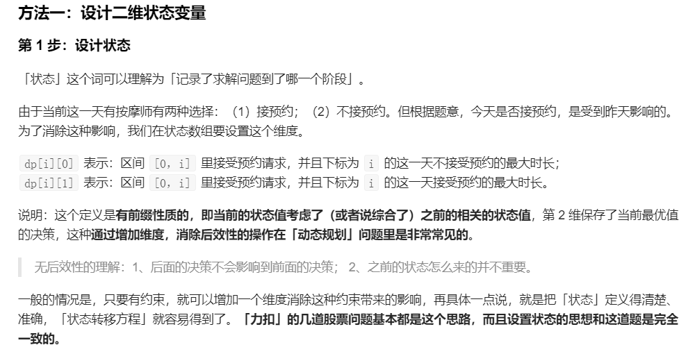


## 贪心

[330. 按要求补齐数组](https://leetcode-cn.com/problems/patching-array/)


## 位运算

[231. 2的幂](https://leetcode-cn.com/problems/power-of-two/)

[371. 两整数之和](https://leetcode-cn.com/problems/sum-of-two-integers/)


## 二叉树的遍历

[222. 完全二叉树的节点个数](https://leetcode-cn.com/problems/count-complete-tree-nodes/)

[230. 二叉搜索树中第K小的元素](https://leetcode-cn.com/problems/kth-smallest-element-in-a-bst/)

[235. 二叉搜索树的最近公共祖先](https://leetcode-cn.com/problems/lowest-common-ancestor-of-a-binary-search-tree/)

[236. 二叉树的最近公共祖先](https://leetcode-cn.com/problems/lowest-common-ancestor-of-a-binary-tree/)

[331. 验证二叉树的前序序列化](https://leetcode-cn.com/problems/verify-preorder-serialization-of-a-binary-tree/)

[1361. 验证二叉树](https://leetcode-cn.com/problems/validate-binary-tree-nodes/)


## Map的运用

[217. 存在重复元素](https://leetcode-cn.com/problems/contains-duplicate/)

[219. 存在重复元素 II](https://leetcode-cn.com/problems/contains-duplicate-ii/)

[220. 存在重复元素 III](https://leetcode-cn.com/problems/contains-duplicate-iii/)


## 栈

[71. 简化路径](https://leetcode-cn.com/problems/simplify-path/)

[232. 用栈实现队列](https://leetcode-cn.com/problems/implement-queue-using-stacks/)


### 单调栈

[496. 下一个更大元素 I](https://leetcode-cn.com/problems/next-greater-element-i/)


## 快慢指针

[234. 回文链表](https://leetcode-cn.com/problems/palindrome-linked-list/)


## 链表操作

[237. 删除链表中的节点](https://leetcode-cn.com/problems/delete-node-in-a-linked-list/)

[984. 不含 AAA 或 BBB 的字符串](https://leetcode-cn.com/problems/string-without-aaa-or-bbb/)


## 子串查找算法

##### 1. KMP算法

[28. 实现 strStr()](https://leetcode-cn.com/problems/implement-strstr/)

~~~java
/**
 * 构建next数组。算法核心，必须理解。
*/
private int[] getNext(String needle) {
    int len = needle.length();
    int[] next = new int[len];
    // j就是遍历的下标。外循环每次都会+1
    // i很关键，表示应跳转的下标，也对应着needle的j下标前面匹配的对数。后面详解。
    int j = 0, i = -1;
    // 先初始化next[0] = -1。因为needle下标为0，不可能有匹配的。为什么要设置为-1，而不是0呢。在下面内循环中可以用i = -1作为退出循环的条件
    next[j] = i;
    while (j < len) {
        // i >= 0的时候说明还有匹配到的可能。所以判断一下两个字符是否相等。不相等就把i回退。这里需要画图理解。
        while (i >= 0 && needle.charAt(i) != needle.charAt(j)) {
            i = next[i];
        }
        // i代表的是上一次匹配成功的个数，所以这一次需要在上一次的基础上+1
        i++;
        // j代表的是上一次的needle下标，这里要更新为这次的
        j++;
        // 如果不越界，填充next数组的值
        if (j < len)
            next[j] = i;
    }
    return next;
}
~~~

上面的文字解析不是很清楚，下面我们画图抽丝剥茧把这个搞明白。

来一个needle字符串**`abaababb`**，一个数组**`int[] next`**。匹配的机制是`j`下标前的字符，前半段有多少与后半段相同。

1. 初始化：`next[j] = i;`

   

   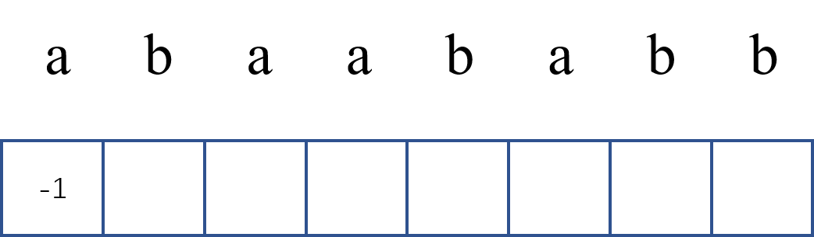

   **注：**字符对应的数字（比如：1a对应的-1）表示的是：**到a这发生了不匹配，下标需要跳转到的位置**，同时也表示的是**a前面字符匹配的对数**

2. 遍历生成next

   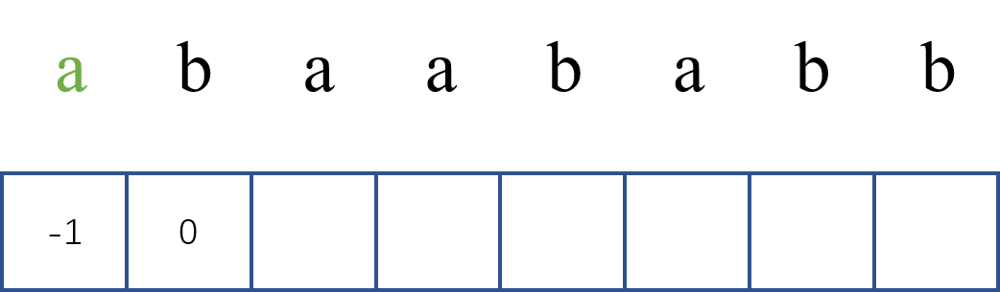

   1b对应为0，因为前面只有一个a，没有能够匹配的。

   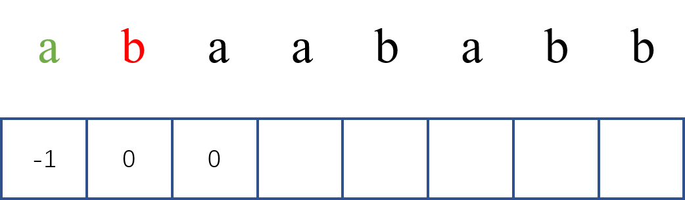

   2a对应为0，因为前面的a、b不匹配

   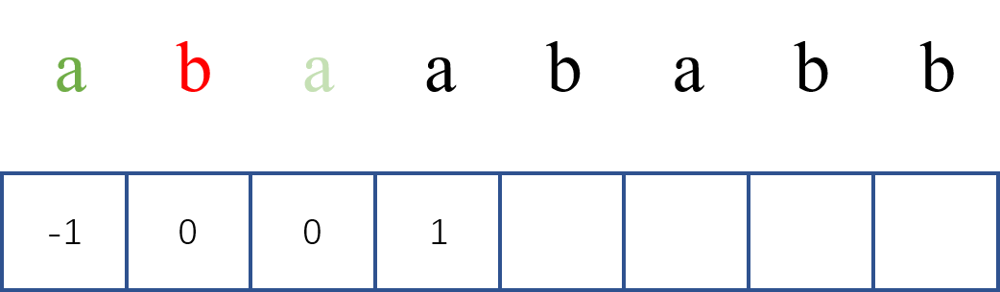

   3a对应为1，因为前面0a和2a匹配上了，当在4a处与文本串发生不匹配时（此时3a已经匹配上了），模式串只需返回到下标为1处。判断1b能不能与文本串匹配，0a就不用管了，因为它与2a匹配上了，所以必定会与文本串匹配上。见下图：

   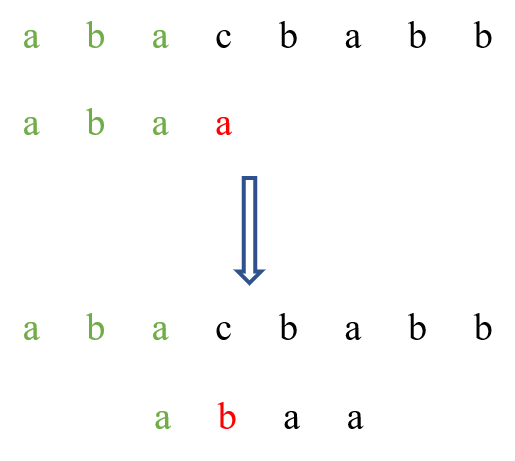

   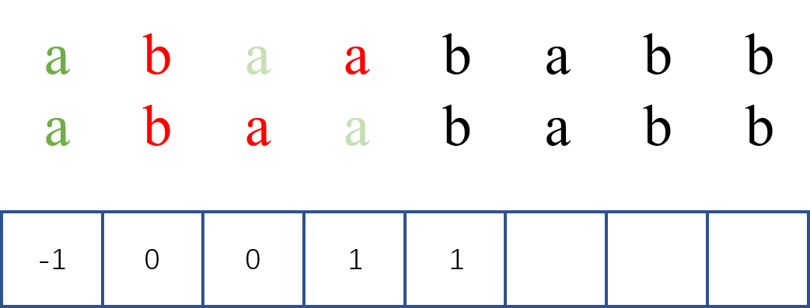

   4b对应的下标或者说前面匹配的个数，分了两步，也就是内循环了一次。因为在找3a的时候，已经发现0a和2a匹配上了，所以那么再看一下1和3位置的字符能否匹配。如果匹配上了，也就是ab ab，那么4b对应的就为i+1 = 2了（i保存了上一次匹配对数或者下标的信息）。但是这时候没有匹配上，那么导致内循环一次，**`i = next[i]`。这句代码是什么意思呢？i 处与 j 处没匹配上，因为相当于自己匹配自己，所以 i 需要通过next数组回退，用尽量少的次数找一个能与 j 处字符匹配的地方 **

   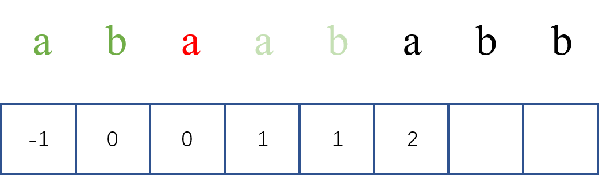

   在5a处，同理，因为 i 记录了上一次的1，正因为 i 又是记录着下标的信息，所以在正好判断 i 处字符（此处为1b）是否等于 j 处字符，而1b 与 4b相同，所以5a为2。

   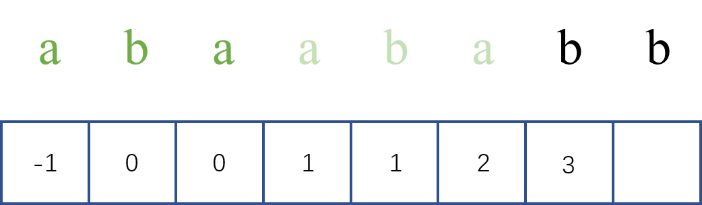

   同上

   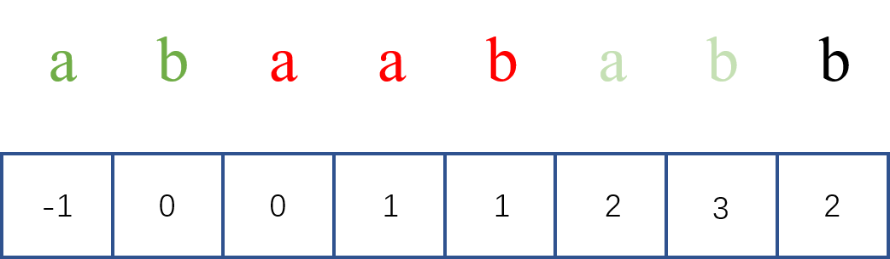

   同上

##### 2. sunday算法

需要用map记住每个元素最靠右的位置


## 堆

[295. 数据流的中位数](https://leetcode-cn.com/problems/find-median-from-data-stream/)


## 前缀和

[187. 重复的DNA序列](https://leetcode-cn.com/problems/repeated-dna-sequences/)（字符串hash+前缀和）

[303. 区域和检索 - 数组不可变](https://leetcode-cn.com/problems/range-sum-query-immutable/)

[304. 二维区域和检索 - 矩阵不可变](https://leetcode-cn.com/problems/range-sum-query-2d-immutable/)


## 树状数组

[307. 区域和检索 - 数组可修改](https://leetcode-cn.com/problems/range-sum-query-mutable/)

教程地址：[](https://www.bilibili.com/video/BV1pE41197Qj?from=search&seid=13913161421319015056)

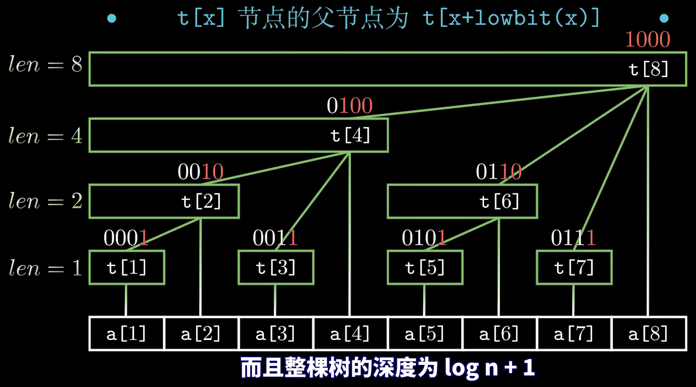

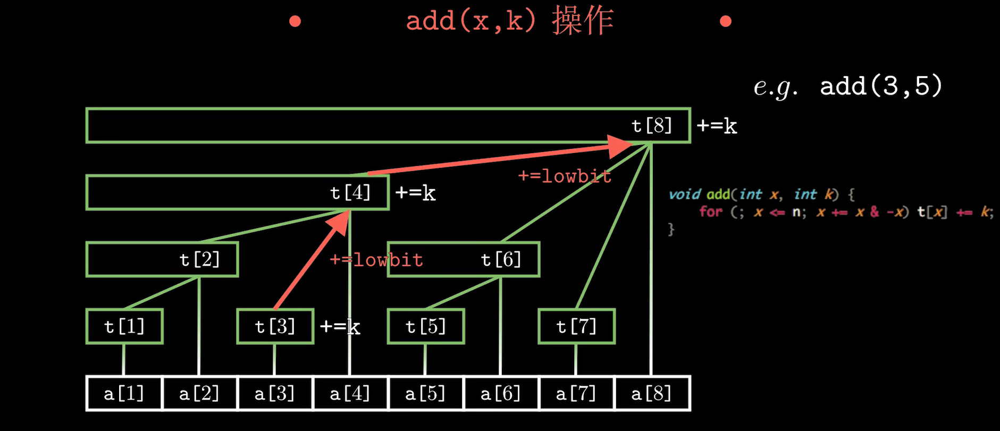

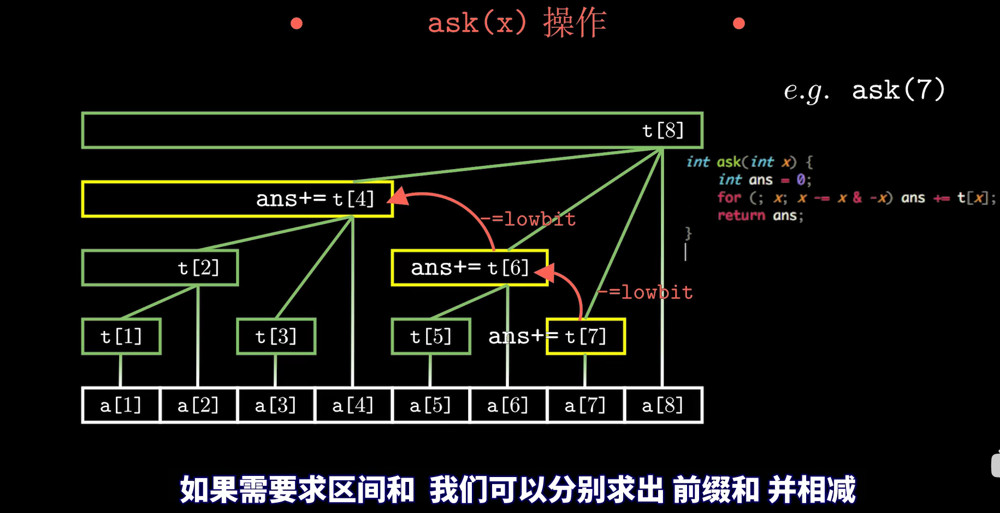


## 数学

[29. 两数相除](https://leetcode-cn.com/problems/divide-two-integers/)

- 可以用减法模拟除法。不过如果单纯的减去减数，然后给结果+1，会导致超时。我们可以一次性多减点（减2的幂，也就是divisor << i）
- 因为结果必定在[0, dividend]区间内，可以采用二分法

[400. 第 N 位数字](https://leetcode-cn.com/problems/nth-digit/)（学习如何取一个数字的第几位数）

[507. 完美数](https://leetcode-cn.com/problems/perfect-number/)（查找所有因数的循环条件：`i <= math.Sqrt(num) -> i <= num / i）`

[556. 下一个更大元素 III](https://leetcode-cn.com/problems/next-greater-element-iii/)

[1980. 找出不同的二进制字符串](https://leetcode-cn.com/problems/find-unique-binary-string/)（康托尔对角线证明）


## 并查集

[1559. 二维网格图中探测环](https://leetcode-cn.com/problems/detect-cycles-in-2d-grid/)


## 字符串hash

[187. 重复的DNA序列](https://leetcode-cn.com/problems/repeated-dna-sequences/)（字符串hash+前缀和）


## 数组下标trick

[442. 数组中重复的数据](https://leetcode-cn.com/problems/find-all-duplicates-in-an-array/)

